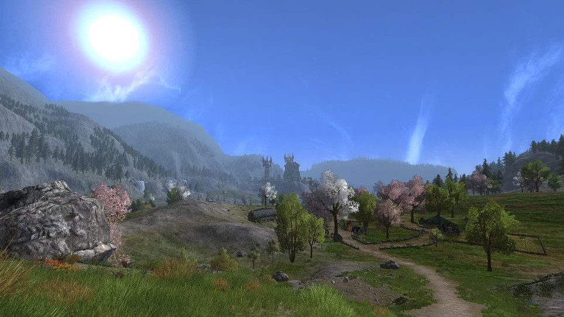

Screenshot from <a href="https://www.tentonhammer.com/articles/gondor-and-more-in-dev-play-session-with-lotro-s-update-14">TenTonHammer</a>
  
<!--
 &nbsp;-->

## 👋 Hello, I'm Anna

- 💻 I'm currently working as a __Junior IT Specialist__
- 📚 I'm currently learning about __Networks__
- 📝 I'm interested in the __APIs__ and __Test Automation__ 
- 🏆 I'm striving to increase my GitHub stats rating by participating in group projects
- 🏺 Fun fact: I studied archaeology and tend to inspect any suspicious looking rocks

## 💻 My Tech Stack

## 🏆 My Stats

    &nbsp;&nbsp;
    &nbsp;&nbsp;

## 📡 Contact me
 &nbsp;
 &nbsp;

